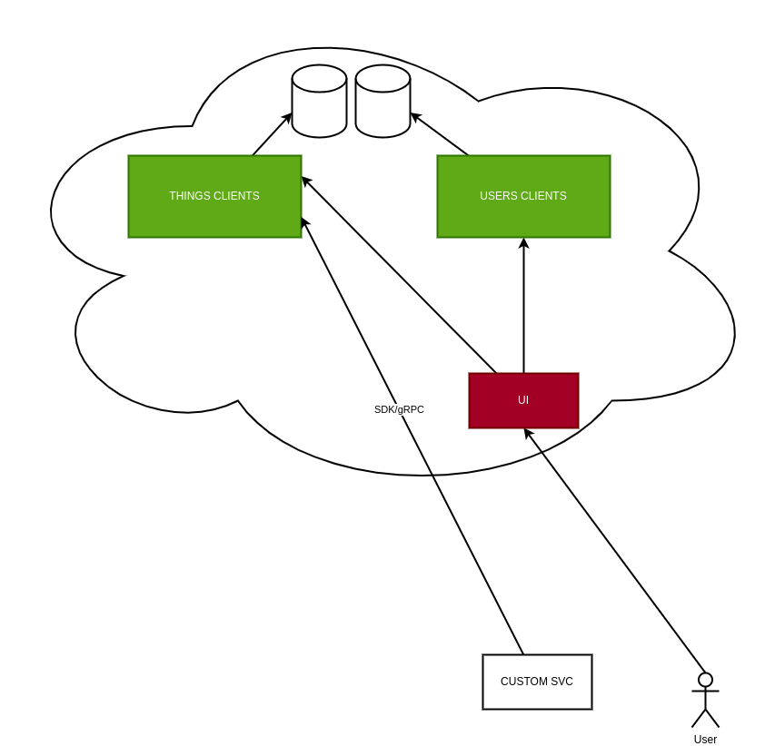
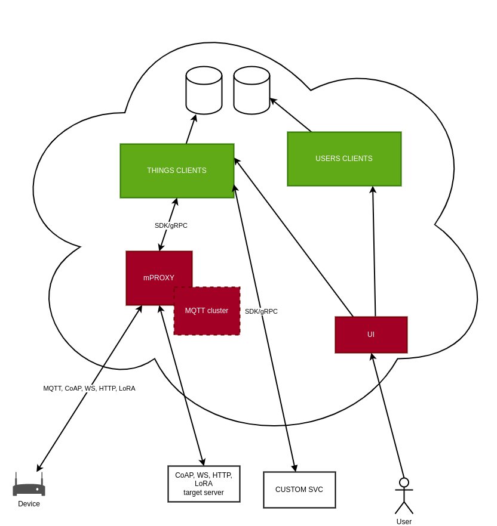

# AllAuth product development

## AllAuth components

As you can see from the architecture overview below, AllAuth consists of the following components:

- Clients deployment for Users
- Clients deployment for Things
- mProxy deployment
- UI
- SDK/gRPC client

Users, Things, mProxy, and UI are deployed in the cloud. Components we already have developed are marked green, components we need to develop are red.

## AllAuth product

High overview of what needs to be done:

- [x] Identify components and define the flow
- [ ] Create website
- [ ] Infrastructure research and provisioning
- [ ] Development
- [ ] Monitoring
- [ ] Billing
- [ ] Pricing research

Each of these tasks will be executed in multiple steps and creating a backlog for those steps is an implicit task. The list of tasks is sorted by order of execution, but some can also be executed in parallel.

## AllAuth development plan

THe first goal is to reach the following, simplified architecture model:

This is a minimal usable subset of components that enables using our product as a simple IAM server. It includes development of the UI and modifying our Clients components to suit product goal. Once this is done, we start working on the more advanced version that includes IoT/messaging auth component. First, we will focus on MQTT protocol, and add support for other protocols as we progress with development.

The ultimate goal is to add **our MQQTT broker** and provide messaging and access control out of the box:

