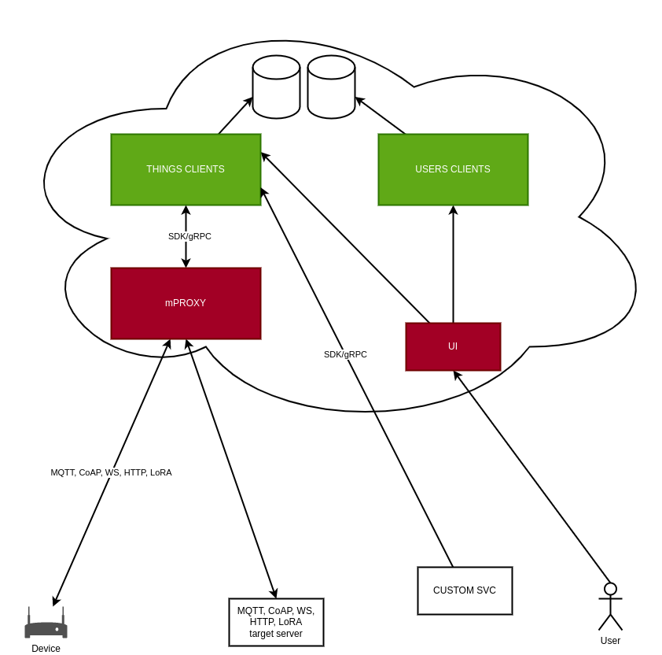

# AllAuth product development

## AllAuth components

As you can see from the architecture overview below, AllAuth consists of the following components:

- Clients deployment for Users
- Clients deployment for Things
- mProxy deployment
- UI
- SDK/gRPC client

Users, Things, mProxy, and UI are deployed in the cloud. Components we already have developed are marked green, components we need to develop are red.

## AllAuth product

High overview of what needs to be done:

- [x] Identify components and define the flow
- [ ] Create website
- [ ] Infrastructure research and provisioning
- [ ] Development
- [ ] Monitoring
- [ ] Billing
- [ ] Pricing research

Each of these tasks will be executed in multiple steps and creating a backlog for those steps is an implicit task. The list of tasks is sorted by order of execution.

## AllAuth development plan

Once we identify steps 