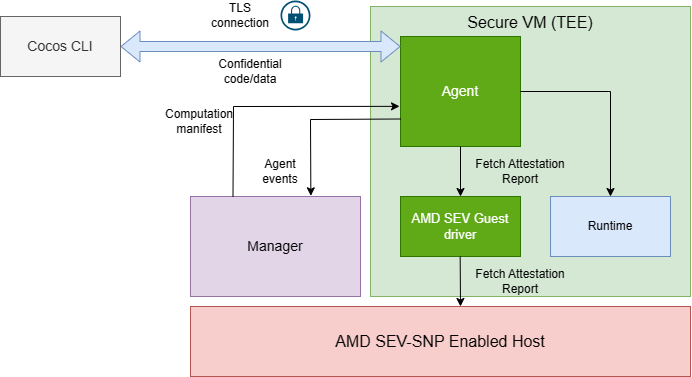

# Agent

The agent is responsible for the life cycle of the computation, i.e., running the computation and sending events about the status of the computation within the TEE. The agent is found inside the VM (TEE), and each computation within the TEE has its own agent. When a computation run request is sent from from the manager, manager creates a VM where the agent is found and sends the computation manifest to the agent. 

The picture below shows where the Agent runs in the Cocos system, helping us better understand its role.

{ align=center }

## Agent Events

As the computation in the agent undergoes different operations, it sends events to the manager so that the user can monitor the computation from either the UI or other client. Events sent to the manager include computation running, computation finished, computation failed, and computation stopped.

## Vsock Connection Between Agent & Manager

Agent sends agent events to the manager via vsock. The manager listens to the vsock and forwards the events via gRPC. The agent events are used to show the status of the computation inside the TEE so that a user can be aware of what is happening inside the TEE.

## Security

To run a computation in the agent, a signed certificate is required. The certificate is used to verify the user who is running the computation. The certificate is sent to the agent by the manager, and the agent verifies the certificate before running the computation.

## Attestation

The Agent can fetch the [attestation](./attestation.md) report from the host using the AMD SEV guest driver. The attestation report proves that the Agent is running inside the secure virtual machine (SVM) and that the SVM is running the expected code on the expected hardware and is configured correctly.