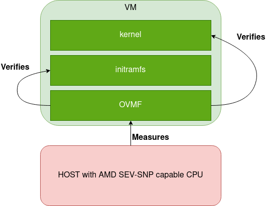

# Hardware Abstraction Layer (HAL)
HAL is an abstraction layer for confidential computing. It is an in-memory virtual machine (VM). For Cocos, HAL is used with SEV-SNP to provide a fully encrypted VM.

HAL consists of the following:

* Linux kernel v6.6 - vmlinuz archive with the standard Linux kernel v6.6 with support for AMD SEV.
* File system - the initial RAM file system (initramfs) that is used as the root file system of the VM.

## How is HAL constructed?
HAL is made using the tool Buildroot. Buildroot is used to create efficient, embedded Linux systems, and we use it to create the compressed image of the kernel (vmlinuz) and the initial file system (initramfs).

HAL configuration for Buildroot also includes Python runtime and agent software support. You can read more about the Agent software [here](agent.md).

## How does it work?
HAL is combined with AMD SEV-SNP to provide a fully encrypted VM that can be verified using remote attestation. You can read more about the attestation process [here](attestation.md).

Cocos uses QEMU and Open Virtual Machine Firmware (OVMF) to boot the confidential VM. During boot with SEV-SNP, the AMD Secure Processor (AMD SP) measures (calculates the hash) of the contents of the VM to insert that hash into the attestation report. This measurement is proof of what is currently running inside the VM. The problem with SEV is that it only measures the Open Virtual Machine Firmware (OVMF). To solve this, we have built OVMF so that OVMF contains hashes of the vmlinuz and initrams. Once the OVMF is loaded, it will load the vmlinuz and initramfs into memory, but it will continue the boot process only if the hashes of the vmlinuz and initramfs match the hashes stored in OVMF. This way, the attestation report will contain the measurement of OVMF, with the hashes, and OVMF will guarantee that the correct kernel and file system are booted. The whole process can be seen in the following diagram. The green color represents the trusted part of the system, while the red is untrusted:

{ align=center }

This process guarantees that the whole VM is secure and can be verified. 

After the kernel boots, the agent is started and ready for work.